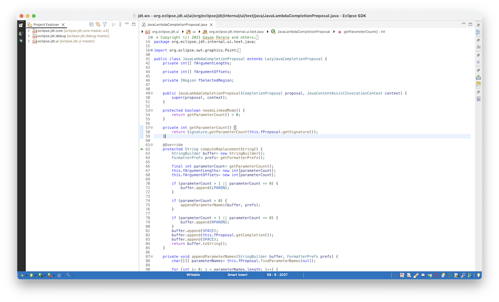

## GAP Eclipse Themes 
Eclipse themes and some features to enhance the look and feel of Eclipse Java IDE

Currently this plug-in provides following themes

-   VSCode Light

-   VSCode Light (Pre 2022-06)
[**This theme must be used if you are not running Eclipse 2022-06 Milestones**]

## Installation

### Nightly Builds
[Update Site (https://gayanper.github.io/eclipse-themes/p2/i-builds)](https://gayanper.github.io/eclipse-themes/p2/i-builds)

## License
gap-eclipse-themes is distributed under the [EPL](http://www.eclipse.org/legal/epl-v10.html) license.
