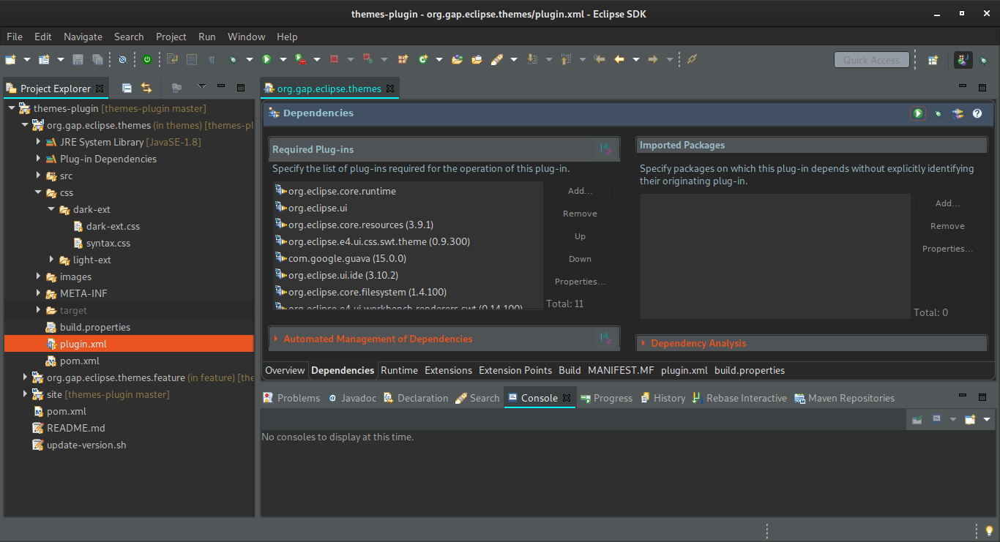
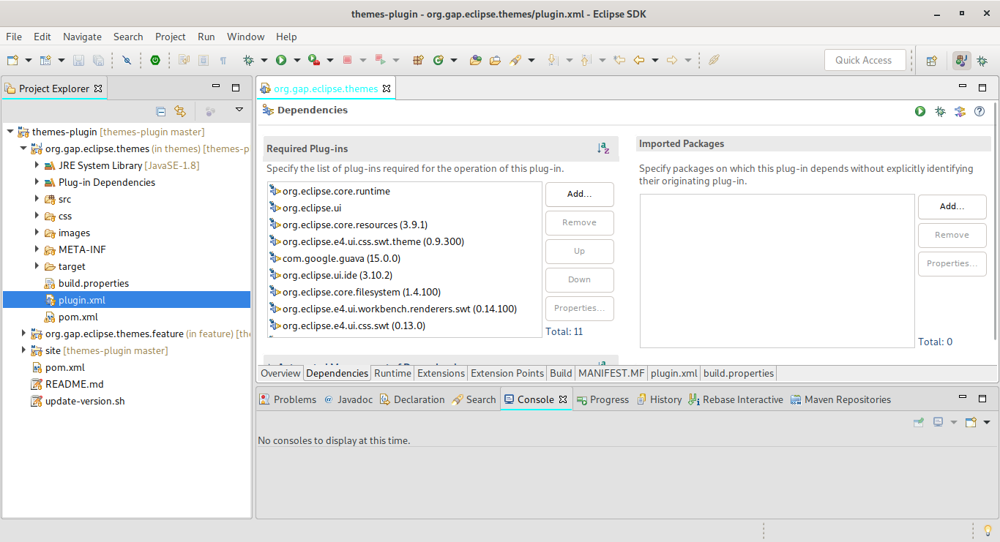

### Welcome to Eclipse Themes.
This plugin contains some extra themes modification for the default light and dark themes in eclipse.

#### Installation
1. Add the following update site https://dl.bintray.com/gayanper/p2/eclipse-themes
2. Install the plugin
3. Restart eclipse

#### Theme customization
##### Dark theme
-   Styled Tab Headers
-   Syntax highlighting for for following plugin
    -   KaiZen OpenAPI Editor
    -   YEdit
    -   Groovy
    -   JenkinsEditor

##### Light theme
-   Styled Tab Headers

#### Screenshots

